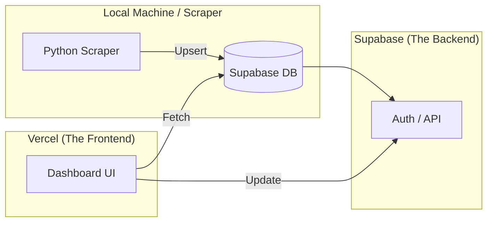

# Phase 2: Full-Stack Transition (Supabase & Vercel)

This plan explains the benefits of using Supabase and Vercel and provides a step-by-step guide to migrating the project from a local-only setup to a live web application.

## ❓ Why Supabase and Vercel?

### Is it necessary?
No, your current local setup works for you personally. However, to turn this into a **Full-Stack Application** that others can use and that lives on the web, these tools are essential.

| Feature | Local Setup (Now) | Full-Stack Setup (Supabase + Vercel) | Why it matters |
| :--- | :--- | :--- | :--- |
| **Database** | Local SQLite File | Cloud PostgreSQL | **Real-time access:** Your data is live and accessible from anywhere, not just your laptop. |
| **Hosting** | Localhost / Manual Git | Vercel Automation | **Instant Deployment:** Every time you save code, your website updates instantly at a public URL. |
| **Auth** | None (Anyone can edit) | Supabase Auth | **Security:** Only *you* can approve or reject events via a login. |
| **Real-time** | Manual Refresh | WebSocket Push | **Speed:** When the scraper finds food, the dashboard updates *instantly* without refreshing. |

---

## 🏗 Full-Stack Architecture

---

## 🚀 Expert Approach vs. Quick Approach

An expert doesn't just "move code"; they build a **Pipeline**.

| Feature | Quick Path (Student) | Expert Path (Pro) |
| :--- | :--- | :--- |
| **Migrations** | Edit DB in UI directly. | Use SQL migration files for version control. |
| **Environments** | Push directly to `main`. | Use a `staging` branch for testing before `main`. |
| **Data Safety** | Manual backups. | Automated daily backups + Point-in-Time Recovery. |
| **Error Handling** | `print()` statements. | Sentry or Logtail for real-time error alerts. |

---

## ⚠️ Common Pitfalls to Watch Out For

1. **CORS Errors**: Browsers block requests between different "Origins" (e.g., your Vercel site trying to talk to your local Flask API). Moving everything to Supabase solves this.
2. **Environment Variable Drift**: Forgetting to add your Supabase keys to Vercel. **Rule:** If it's in `.env`, it *must* be in Vercel Settings.
3. **Database Connections**: SQLite is "one user at a time." Supabase (Postgres) can handle many, but has connection limits. Use the "Connection Pool" if you scale.
4. **Secret Exposure**: **NEVER** commit your `.env` file to GitHub. Add it to `.gitignore` immediately.

---

## 💰 Is it free?

**Yes, for your current scale.**

- **Supabase Free Tier**: Includes 500MB of database space, 5GB of bandwidth, and 50,000 monthly active users. This is *plenty* for a university project.
- **Vercel Hobby Tier**: Free for personal, non-commercial projects. Includes automatic custom domains (e.g., `free-food.vercel.app`) and SSL.

---

## 📋 Step-by-Step Implementation Plan

### 1. Supabase Initialization
- [ ] **Create Supabase Project**: Set up a new project at [supabase.com](https://supabase.com/).
- [ ] **Define Schema**: Create the `food_events` table in the SQL Editor.
- [ ] **Secure Data**: Enable Row Level Security (RLS) so anyone can read events, but only authenticated users can `UPDATE` (approve/reject).

### 2. Backend Migration (Python)
- [ ] **Switch Database Client**: Install `supabase-py` (`pip install supabase`).
- [ ] **Update `main.py`**: Replace `sqlite3` logic with Supabase `upsert` calls.
- [ ] **Environment Variables**: Move Supabase URL/KEY to the `.env` file.

### 3. Frontend Migration (JS)
- [ ] **Supabase Client**: Add the Supabase JS library to `index.html`.
- [ ] **Fetch Logic**: Update `fetchEvents()` to use the Supabase client instead of the local Flask API or JSON file.
- [ ] **Auth Layer**: Add a simple login button so only you can access the "Approve/Reject" buttons.

### 4. Vercel Deployment
- [ ] **Connect Repository**: Link your GitHub repo to Vercel.
- [ ] **Set Config**: Configure the build settings to point to the `frontend/` directory.
- [ ] **Secure Variables**: Add your Supabase keys to Vercel's environment variables.

---

## 🎯 Next Steps

1. **Safety First**: Backup `free_food.db`.
2. **Sign up**: Create free accounts on [Supabase](https://supabase.com/) and [Vercel](https://vercel.com/).
3. **Connect**: Set up your GitHub integration on Vercel.
